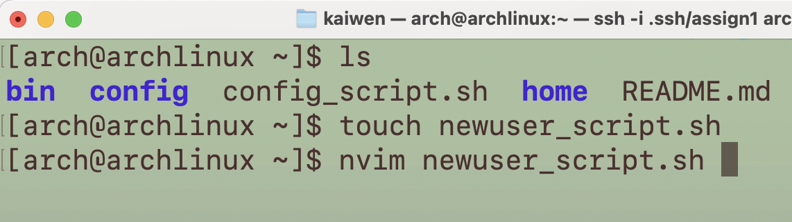
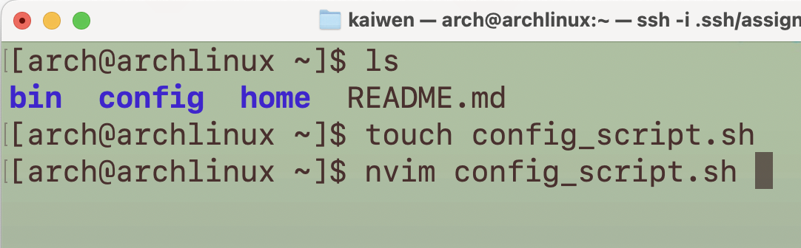

# ACIT2420 Assignment 2

## Basic Setup

Transfer starting files to the remote arch linux tablet using `sftp`

1. Start a sftp sesstion

```
sftp -i ~/.ssh/<public_key> user@ip-address
```

2. Navigate to the directory on your local machine

```
lcd /path/to/<local_dir>
```

3. Upload all contents

```
put -r *
```

4. Exit this `sftp` session

```
exit
```

> Reference: [Transferring Files with SFTP - DigitalOcean](https://www.digitalocean.com/community/tutorials/how-to-use-sftp-to-securely-transfer-files-with-a-remote-server#transferring-files-with-sftp)

---

## Project 1 Setup

Create the script for new system setup configuring at the remote arch server home directory:


Then use `nvim` to edit this script.

---

## Project 2 Setup

Create the script for adding new users at the remote arch server home directory:



Then use `nvim` to edit this script.

---
